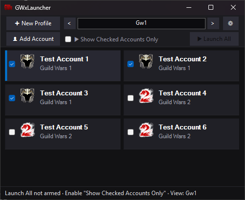
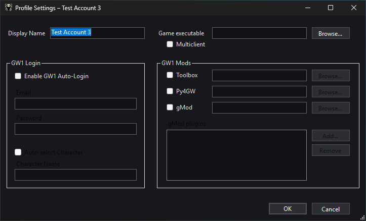

# GWxLauncher
# GWxLauncher

A from-scratch, lightweight **Guild Wars 1 & Guild Wars 2 unified launcher** for Windows.

GWxLauncher focuses on:
- clean profile-based launching
- safe bulk launch (eligibility-based)
- optional GW1 mod injection
- GW2 auto-login / auto-play automation
- clear per-attempt LaunchReport diagnostics

## Screenshots




## Features

### Profiles & bulk launch
- Profile-based configuration (`GameProfile`)
- Bulk launch is **opt-in and eligibility-based** (checked profiles)
- Bulk launch is “enabled” only when:
  - one or more profiles are checked, and
  - **Show Checked Accounts Only** is enabled

### Guild Wars 1 (GW1)
- Optional mod injection support:
  - **GWToolbox++**
  - **Py4GW**
  - **gMod** (with per-profile plugin list)
- Multiclient support (user-controlled toggle)
- Launch reporting per step (success / skipped / warning / failed)

### Guild Wars 2 (GW2)
- Multiclient support (mutex handling + `-shareArchive`)
- Optional **auto-login** (DPAPI protected credentials)
- Optional **auto-play**
- Bulk launch sequencing gates on:
  - Launcher UI rendered
  - Launcher ready (Play enabled)
  - DX window created and rendering (best-effort)

## Download / install

1. Download the latest release from the GitHub **Releases** page.
2. Extract the zip somewhere (e.g. `C:\Tools\GWxLauncher\`).
3. Run `GWxLauncher.exe`.

Settings and per-profile data are stored under `%AppData%\GWxLauncher\`.

## Build from source

Prereqs:
- Visual Studio (or .NET SDK) with Windows Desktop support

Build:
```powershell
dotnet build -c Release
