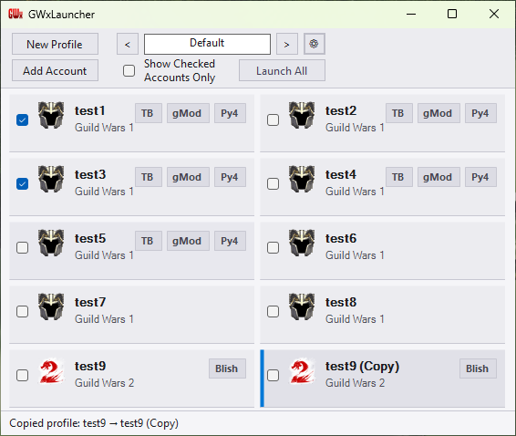

# GWxLauncher

A from-scratch, lightweight **Guild Wars 1 & Guild Wars 2 unified launcher** for Windows.

GWxLauncher focuses on:
- clean profile-based launching
- safe bulk launch (eligibility-based)
- optional GW1 mod injection
- GW2 auto-login / auto-play automation
- clear per-attempt LaunchReport diagnostics

## Screenshots

A quick look at the launcher UI:




## Features

### Profiles & bulk launch
- Profile-based configuration (`GameProfile`)
- Bulk launch is **explicitly opt-in and eligibility-based** (checked profiles)
- Bulk launch is “enabled” only when:
  - one or more profiles are checked, and
  - **Show Checked Accounts Only** is enabled

### Guild Wars 1 (GW1)
- Optional mod injection support:
  - **GWToolbox++**
  - **Py4GW**
  - **gMod** (with per-profile plugin list)
- Mods can be enabled per-profile or controlled globally
- Multiclient support (user-controlled toggle)

### Guild Wars 2 (GW2)
- Multiclient support (mutex handling + `-shareArchive`)
- Optional **auto-login** (DPAPI protected credentials)
- Optional **auto-play**
- **Per-profile AppData isolation** (separate settings, addons, screenshots per account)
  - Uses native DLL injection to redirect GW2's AppData folder per profile
  - Supports optional game folder isolation (separate bin/dat files)
- **Run-after programs** - Launch companion apps (e.g., Blish HUD, TacO) automatically
  - Per-program MumbleLink pairing for overlay integration

### Window Management
- **Per-profile positioning:** Set exact window coordinates and size for each account.
- **Auto-save:** "Remember Changes" option updates your profile automatically when you move or resize the game window.
- **Window Lock:** Prevent accidental resizing or moving of the game window.
- **Input Blocking:** Optional removal of minimize/close buttons for kiosk-like setups.
- **Startup Enforcement:** Anti-bounce logic ensures windows land exactly where configured during game release/splash screen transitions.

## Requirements

- **Windows 10/11** (x86 or x64)
- **[.NET 8 Desktop Runtime](https://dotnet.microsoft.com/download/dotnet/8.0)** (if not already installed)
  - Download the **Desktop Runtime** (x86 or x64) from Microsoft
  - Most users will already have this installed from Windows Update

## Download / install

1. Download the latest release from the GitHub **Releases** page.
2. Extract the zip somewhere (e.g. `C:\Tools\GWxLauncher\`).
3. Run `GWxLauncher.exe`.
   - If you see a ".NET runtime not found" error, install the [.NET 8 Desktop Runtime](https://dotnet.microsoft.com/download/dotnet/8.0)

Settings and per-profile data are stored under `%AppData%\GWxLauncher\`.

## Build from source

### Prerequisites:
- **Visual Studio 2022** (or .NET 8 SDK) with Windows Desktop / C++ workloads
  - C# / .NET 8 for main launcher
  - C++ for native DLL (Gw2FolderHook.dll)
- **Windows 10/11** SDK

### Build steps:

**Option 1: Visual Studio**
1. Open `GWxLauncher.slnx` in Visual Studio
2. Ensure platform is set to **x86** (not Any CPU)
3. Build → Build Solution (Ctrl+Shift+B)
   - Native DLL and x64 injector build automatically via MSBuild targets

**Option 2: Command Line**
```powershell
# Build everything (native DLL, injector, and launcher)
dotnet build -c Release

# Or use the PowerShell build functions:
cd "C:\Git Projects\GWxLauncher"

# Build native DLL only
cd Native
.\Build.ps1

# Publish single-file executable
cd ..
dotnet publish -c Release -r win-x86 /p:PublishSingleFile=true /p:SelfContained=false
```

**Output:** `bin\Release\net8.0-windows\win-x86\publish\GWxLauncher.exe` (~1MB single-file executable)
